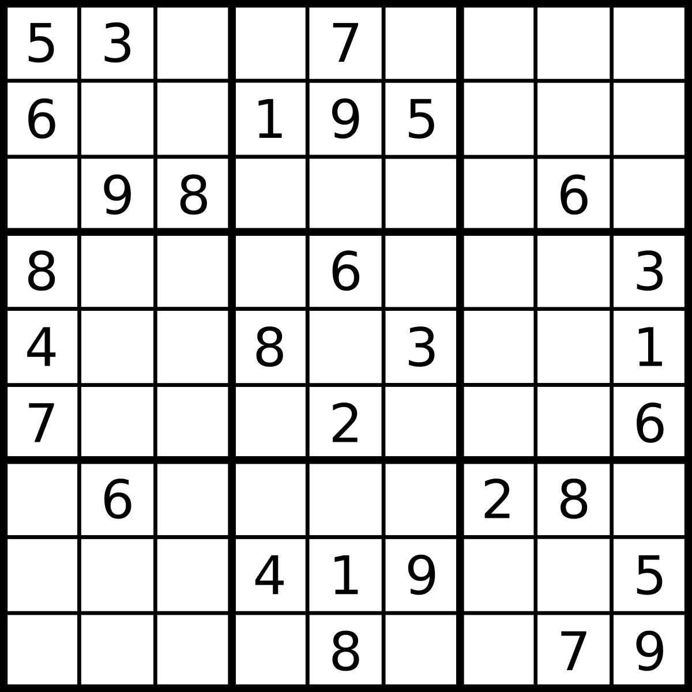
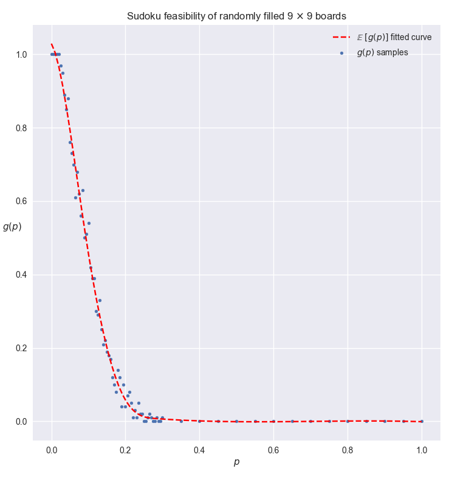

# Solving Sudoku Using Interger Linear Programming (ILP)

## Introduction

Some intro blah blah

## Interger Linear Program Formulation

To solve Sudoku puzzle as a linear program, there is no need to find a optimum maximum/minimum of some objective function.

Objective function:

$$
\min Z = 0\\
$$

Now we require the feasibility of each square being a an interger value in $[1,9]$ with the constraints being each cell value must be unique to that row, column and box (sub $3\times 3$ boards). For a $9\times 9$ board $M$ indexed by two integers $i,j\in [1,9]$ for every cell in $M$ and possible values $v\in [1,9]$ and we create decision variables $x$ which is denoted as $x_{ijv}$ that represents whether a value $v$ is chosen corresponding to its cell $i,j$ thus $x$ is either $1$ or $0$. 

Thus the constraints are **Subject to**:

$$
\begin{cases}
    & \Sigma_{v = 1}^{9} x_{ijv} = 1,& \text{for } i,j \in [1, 9], \text{one } v \text{ per cell} \\
    & \Sigma_{i = 1}^{9} x_{ijv} = 1,& \text{for } j,v \in [1, 9],\text{one } v \text{ per row} \\
    & \Sigma_{j = 1}^{9} x_{ijv} = 1,& \text{for } i,v \in [1, 9],\text{one } v \text{ per column} \\
    & \Sigma_{j=3p-2}^{3p} \Sigma_{i=3q-2}^{3q} x_{ijv} = 1,& \text{for } v \in [1, 9],p,q \in [1,3],\text{one }v \text{ per } 3\times 3 \text{ sub-board}\\
    & x_{ijv} = 1,& \text{for } x_{ijv} > 0 \in M_{ij} \text{ already assigned cells}\\
    & \forall x \in [0,1] & \text{decision variables}
\end{cases}
$$

## [Implementation of Sudoku ILP solver in Gurobi Python](solver.py)

## Empirical analysis of Sudoku solving for randomly generated $9\times 9$ boards

### [Generating random boards Implementation](generate_board.py)

Generate a $9\times 9$ board with some probability $p\in (0,1)$ that is $M_p$, for every cell in $M_p$ of having a number assigned randomly independently, which is a random value chosen uniformly in $[1,9]$, otherwise indicate as $0$ as it is not assigned.

Let $g(p)$ be  the expected probability that $M_p$ is solvable. Trivial cases are for $g(0)=1$ because with $p=0$ the board will have no assigned cells thus is always feasible and other case $g(1)\approx 0$ for when every cell is assigned randomly it is almost never going to satisfy all of our constraints.

### [Empirical Results Script Implementation](results.py)

After many runs and the sake of resourcefulness I have chosen $p \in \{0.005,0.01,\dots,0.3\} \cup \{0.35, 0.4,\dots,0.95\}$ as it had shown convergence to $0$ rapidly after $0.3$, and 100 samples for each $p$ to calcuate the average $\mathbb{E}[g(p)]$ of whether the boards were feasible or not according to their probability $p$.

The red curve is an approximate fitted line displaying the general trend of
the samples.

Results show that the probability of randomly filled boards being feasible decrease drastically as $p$ increases, it is observed that for value $p^*\approx 0.27$ is the smallest value of $p$ such that $g(p^*)\approx 0$ consistently.
